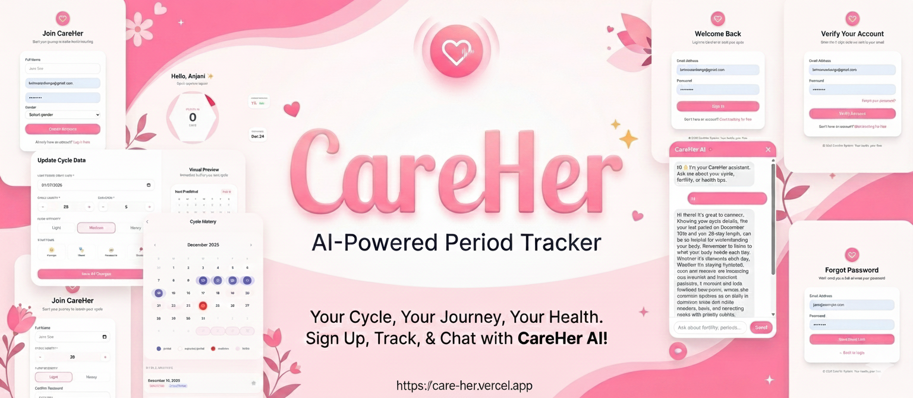
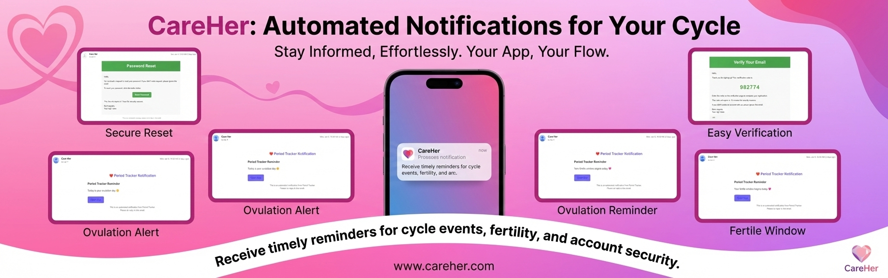

# 🌸 Care_Her – Smart Period Tracking & AI Assistant

Care_Her is a **full-stack MERN web application** designed to help women track their menstrual cycles, predict future periods, and receive personalized assistance through an **AI-powered chat assistant**.  
The system focuses on **privacy, simplicity, and health awareness**, making it suitable for students, professionals, and healthcare-aware users.

---



## 🚀 Features

### 🔐 Authentication
- User registration & login (JWT-based)
- Protected routes
- Secure password hashing

### 📅 Period Tracking
- Add & update cycle details
- Predict next cycle dates
- Cycle history tracking
- Dashboard overview

### 🤖 AI Chat Assistant
- AI-powered health guidance (Gemini API)
- Answers period-related questions
- Friendly, supportive chatbot UI
- Backend-based AI request handling (secure API usage)

### 📊 Dashboard
- User-specific data visualization
- Recent cycle history
- Quick access to AI assistant

---

## 🧠 AI Integration

This project integrates **Google Gemini API** to provide:
- Natural language responses
- Period-related guidance
- General wellness suggestions

> ⚠️ AI responses are **informational only** and not a replacement for medical advice.

---

## 🛠️ Tech Stack

### Frontend
- React + TypeScript
- Redux Toolkit
- Tailwind CSS
- React Router

### Backend
- Node.js
- Express.js
- TypeScript
- MongoDB + Mongoose
- JWT Authentication

### AI
- Google Gemini API

### Deployment
- Frontend: **Vercel**
- Backend: **Railway**
- Database: **MongoDB Atlas**

---

## 📁 Project Structure

```
mern_crud/
│
├── backend/
│ ├── src/
│ │ ├── controllers/
│ │ ├── routes/
│ │ ├── middleware/
│ │ ├── models/
│ │ └── server.ts
│ └── package.json
│
├── frontend/
│ └── Care_Her/
│ ├── src/
│ ├── public/
│ └── package.json
│
└── README.md
```

---

## ⚙️ Environment Variables

### Backend `.env`

```env
PORT=5000
MONGO_URI=your_mongodb_atlas_url
JWT_SECRET=your_jwt_secret
GEMINI_API_KEY=your_gemini_api_key
CLIENT_URL=http://localhost:5173
```

## 🧪 Running the Project Locally

### 1️⃣ Clone the Repository

```bash
git clone https://github.com/kvn2004/care-her.git
cd care-her

2️⃣ Backend Setup
cd backend
npm install
npm run dev

3️⃣ Frontend Setup
cd frontend/Care_Her
npm install
npm run dev
```
## 🔐 Protected Routes

Routes such as **Dashboard**, **History**, and **AI Chat** are protected using authentication middleware.  
Unauthorized users are automatically redirected to the **login page**.

---

## 🌍 Deployment

- **Frontend** deployed on **Vercel**
- **Backend** deployed on **Render**
- **MongoDB Atlas** used as the cloud database

This setup allows **100% free deployment**, making it ideal for **academic projects**.

---

## 🎓 Academic Purpose

This project was developed as part of an **undergraduate software engineering assignment**, demonstrating:

- MERN stack architecture
- Secure authentication
- AI integration
- Clean UI/UX design
- Real-world problem solving

---

## 🚧 Future Enhancements

- Mobile application (Flutter)
- Push notifications
- Cycle-based health insights
- Caregiver alerts
- Doctor consultation module

---

## 👨‍💻 Author

**Vihanga Nimsara**  
HND in Computer Science – IJSE  
Aspiring Full Stack / Backend Software Engineer

GitHub: https://github.com/kvn2004

---

## 📜 License

This project is for **educational purposes only**.  
All rights reserved © 2026.
